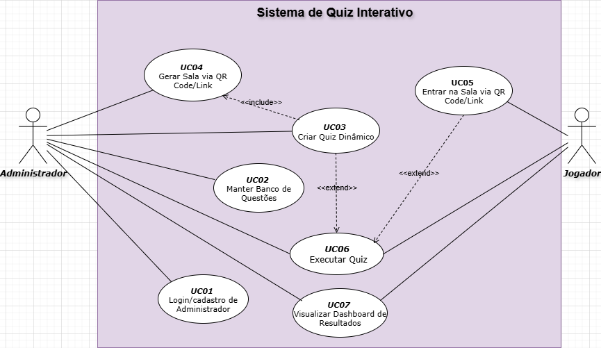

# 🎯 Quizzana

Plataforma web para criação, execução e gerenciamento de quizzes interativos, desenvolvida como parte da disciplina de **Análise e Projeto de Sistemas (APS)** do curso **Técnico em Informática para Internet** da **UTFPR - Campus Campo Mourão**.

---

## 👩‍💻 Desenvolvedoras

- **Isabely Turquino**  
- **Yasmym Lemes**

---

## 🎨 Design no Figma

Você pode visualizar o protótipo completo do projeto no Figma através do link abaixo:

🔗 [Acessar o projeto no Figma](https://www.figma.com/design/1smsJGoTnLJPXJKn5HhUeS/Quizzana?node-id=0-1&t=siwl7Z7EhbI21GGy-1)

---

## 📄 Casos de Uso

O diagrama de casos de uso foi elaborado na ferramenta **draw.io** e está disponível neste repositório:

📁 [`diagrama-casos-de-uso.drawio`](https://drive.google.com/file/d/10h2anWj4GtgzVgSXHaBNBKM1DndSPftN/view?usp=sharing)

---

## 📘 Sobre o Projeto

O **Quizzana** tem como objetivo facilitar a criação e execução de quizzes de forma interativa, promovendo o aprendizado dinâmico e engajado.  
Entre as principais funcionalidades, destacam-se:

- ✏️ Criação de quizzes personalizados  
- 📚 Banco de questões  
- 📊 Relatórios de desempenho  
- 👥 Gerenciamento de participantes  

---

## 🏫 Disciplina

📘 **Análise e Projeto de Sistemas (APS)**  
📍 **UTFPR - Campus Campo Mourão**  
🧭 **Curso Técnico em Informática para Internet (Integrado ao Ensino Médio)**

---
